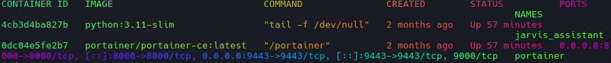
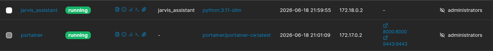
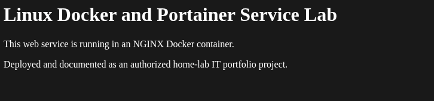
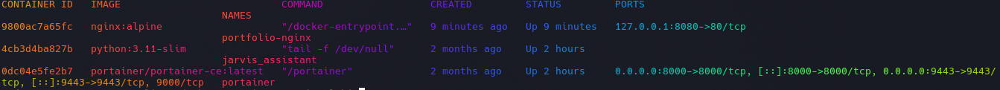
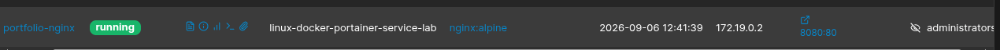

# Linux Docker and Portainer Service Deployment Lab

## Overview
This project documents the deployment and validation of a containerized NGINX web service in an authorized Linux home-lab environment. I used Docker Compose to define the service and Portainer Community Edition to inspect and manage the Docker environment.

## Objectives
- Deploy a web service in a Docker container
- Define the deployment with Docker Compose
- Serve a custom static HTML page through NGINX
- Validate that the service is available locally
- Inspect the container through Portainer
- Document basic operational and security considerations

## Lab Environment
- Host operating system: Arch Linux with XFCE
- Container platform: Docker
- Container orchestration: Docker Compose
- Container management: Portainer Community Edition
- Web-server image: `nginx:alpine`
- Service access: `http://localhost:8080`
- Scope: Authorized personal home-lab environment

## Deployment Configuration
The `compose.yaml` file defines an NGINX container named `portfolio-nginx`. The service maps local host port `8080` to port `80` in the container and mounts the local `site` directory as read-only web content.

```yaml
services:
  web:
    image: nginx:alpine
    container_name: portfolio-nginx
    ports:
      - "127.0.0.1:8080:80"
    volumes:
      - ./site:/usr/share/nginx/html:ro
    restart: unless-stopped
```

## Deployment Steps
1. Confirmed Docker and Portainer were running in the Linux environment.
2. Installed and verified Docker Compose.
3. Created a `compose.yaml` file for the NGINX service.
4. Created a custom `site/index.html` page.
5. Validated the Compose configuration with `docker compose config -q`.
6. Started the service with `docker compose up -d`.
7. Verified the running container with `docker ps`.
8. Tested the web service locally at `http://localhost:8080`.
9. Reviewed the container status through Portainer.

## Validation Results
The NGINX container started successfully and served the custom web page locally. Docker showed the local-only port mapping:

```text
127.0.0.1:8080->80/tcp
```

The site was successfully reached through:

```text
http://localhost:8080
```

## Screenshots

### Existing Docker environment


### Portainer container overview


### Local NGINX web service


### NGINX container running


### NGINX container in Portainer


## Skills Demonstrated
- Linux command-line administration
- Docker container deployment
- Docker Compose configuration
- NGINX web-service deployment
- Portainer container management
- Local HTTP service validation
- Basic network-port awareness
- Technical documentation and evidence collection

## Security Considerations
- This project was completed only in an authorized personal home-lab environment.
- The NGINX service was bound to `127.0.0.1`, limiting intended access to the local computer.
- The static website content was mounted read-only inside the container using `:ro`.
- No credentials, tokens, private keys, personal information, or sensitive network details were included in the repository.

## Future Improvements
- Deploy the service through Portainer as a stack.
- Add an NGINX health check.
- Create a second container and internal Docker network.
- Add service monitoring and log collection.
- Add a reverse proxy and TLS configuration in an isolated lab environment.
